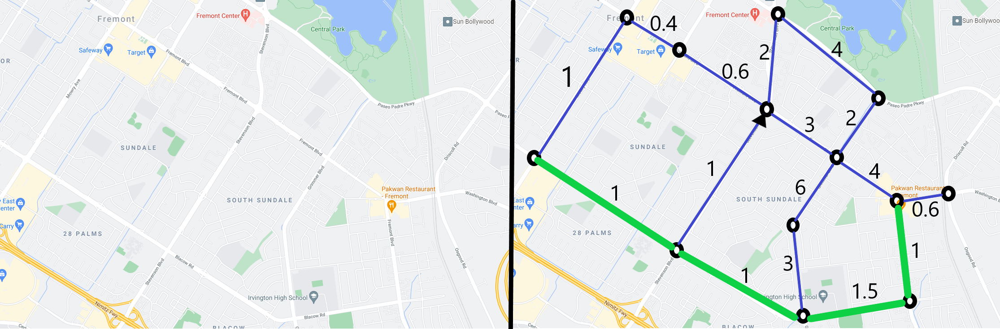

# Code Stack 

# Table of contents
- [Installation](#installation)
- [Graphs](#graphs)
    - [Summary](#summary)
    - [Features](#features)
    - [Depth First Search](#dfs)
        - [Applications](#applications)
    - [Path Finding](#path-finding)
        - [Dijkstra's Algorithm](#dijkstra)
- [Binary Trees](#binary-trees)
    

# Installation
To use the .h files in C++, download the file and use
  ```C++
  #include "NAME OF FILE"
  ```
<br>In place of "template", "T" will be used in the remainder of document.

# Graphs

### Summary
A graph is a data structure containing a set of vertices and a set of edges.<br>
Adding value to vertices the graph becomes **undirected and unweighted**.<br>
A graph becomes **directed** when it's edges get directions, e.g. if an edge connects vertices A and B,<br>
it can be directed in a way that you can only traverse from A to B, not from B to A.
Each edge can also have a number(that can also be negative) representing it's weight, thus making the graph a **directed weighted graph**.

### Features
| Function            | Parameters' types    | Output            | Description                                                                                        |
|---------------------|:--------------------:|:-----------------:|----------------------------------------------------------------------------------------------------|
| add_vertex          | Vertex<T>            | -                 | Adding a vertex to the graph                                                                       |
| add_edge            | T,T                  | -                 | Adding an edge connecting vertices with given values                                               |
| add_edge            | Vertex<T>, Vertex<T> | -                 | Adding an edge connecting the given vertex objects                                                 |
| delete_vertex       | T                    | -                 | Deleting the vertex with the given value                                                           |
| delete_graph        | -                    | -                 | Deleting all graph elements                                                                        |
| show_graph          | -                    | -                 | Prints out all graph elements                                                                      |
| show_vertices       | -                    | -                 | Prints out all graph vertices                                                                      |
| show_edges          | -                    | -                 | Prints out all graph edges                                                                         |
| get_vertices        | -                    | vector<vertex<T>> | Returns a vector containing the vertex objects within the graph                                    |
| get_vertices_values | -                    | vector<T>         | Returns a vector containing the values of the vertices within the graph                            |
| edge_weight         | T,T                  | double            | Returns a double representing the weight of the edge connecting the vertices with the given values |
| DFS                 | T                    | map<T,bool>       | [DFS](#dfs)                                                                                        |
| Dijkstra            | T,T                  | DijkstraOUTPUT    | [Dijkstra](#dijkstra)                                                                              |
  
## DFS

Depth First Search is a traversing algorithm, meaning it can be use to visit vertices in a graph, possibly searching for a specific value or determining which vartices are disconnected from the graph.<br>
DFS takes a starting point as input and then follows a simple algorithm to visit as many nodes as possible.<br>
```C++
for each vertex V in graph G:
    mark V as unvisited
for each vertex U which is a neighbor of V:
    mark U as visited
    DFS(U)
```
The algorithm runs in `O(|E| + |V|)` time where |E| and |V| represent the number of edges and vertices in the graph, respectively.<br>

### Applications

DFS is an algorithm humans use when solving a maze, following a path until reaching a wall, then backtracking and doing the same until a path that leads to a solution is found.<br>
The same can be used in programming to both create a maze and to solve it.<br>

Another application would be finding out which parts of a graph are disconnected by checking which vertices haven't been visited by the algorithm.<br>

## Path Finding

Path finding algorithm are designed to traverse the graph and determine the path, and if there is one, from one vertex to another.<br>
These types of algorithms are usually modified to become **shortest path** algorithm determining the best path from vertex A to vertex B.<br>

These algorithms prove themselves very useful when dealing with problems regarding graphs.<br>

Maps are used to find shortest routes from one location to another, so if a map is turned into a graph, these algorithms can determine the best route, also the second best route and so on.<br>

By making every intersection on the map a vertex, and every road an edge, a graph is formed.<br>

To add a real life element to the graph, one way streets can be edges only going one way, not allowing a path to continue in the opposite way.<br>

Weight can also be addes to signal the length of the road, conditions on the road, traffic and other real life components.<br>

This data can all be processed by a shortest path finding algorithm to determine the best route from A to B.<br>




### Dijkstra


### Binary Trees


